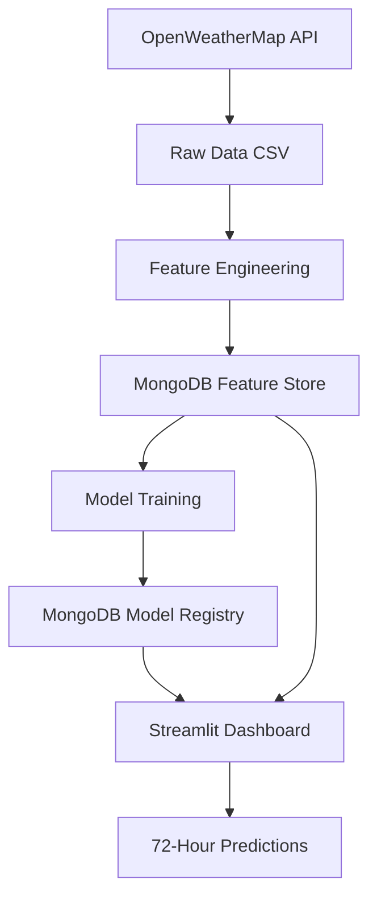

# 🌫️ AQI Prediction Dashboard

A comprehensive Air Quality Index (AQI) prediction system for Karachi, Pakistan, featuring 72-hour forecasting capabilities built with machine learning and deployed as a Streamlit web application.

## 📋 Project Overview

This project consists of three main components:
1. **Data Pipeline**: Fetch and process AQI data from OpenWeatherMap API
2. **Machine Learning**: Train models to predict future AQI values
3. **Web Dashboard**: Interactive Streamlit app for 72-hour AQI forecasting

## 🏗️ Project Structure

```
AQI/
├── main.py                     # Main execution script
├── app.py                      # Streamlit web application
├── setup.py                    # Setup and configuration script
├── run_app.bat                 # Windows batch file to run the app
├── requirements.txt            # Python dependencies
├── Data/
│   ├── 01_data_fetch.ipynb    # Data fetching from OpenWeatherMap API
│   ├── 02_feature_engineer.ipynb # Feature engineering pipeline
│   └── 03_model_train.ipynb   # Model training and evaluation
└── Dataset/
    └── aqi_data.csv           # Raw AQI data
```

## 🔧 Setup Instructions

### 1. Prerequisites
- Python 3.8+
- MongoDB Atlas account (or local MongoDB)
- OpenWeatherMap API key

### 2. Installation

```bash
# Clone or download the project
cd AQI

# Install dependencies
pip install -r requirements.txt

# Run setup and verification
python setup.py
```

### 3. Data Pipeline (Run Once)

Execute the notebooks in order:

1. **Data Fetching** ([01_data_fetch.ipynb](Data/01_data_fetch.ipynb))
   - Fetches 1 year of historical AQI data
   - Covers coordinates: 24.8607°N, 67.0011°E (Karachi)
   - Saves raw data to CSV

2. **Feature Engineering** ([02_feature_engineer.ipynb](Data/02_feature_engineer.ipynb))
   - Creates 138 engineered features
   - Includes lag features, rolling statistics, and time-based features
   - Stores processed data in MongoDB

3. **Model Training** ([03_model_train.ipynb](Data/03_model_train.ipynb))
   - Trains multiple regression models
   - Best model: Gradient Boosting Regressor (R² = 0.9986)
   - Saves trained model to MongoDB

## 🚀 Running the Dashboard

### Method 1: Command Line
```bash
streamlit run app.py
```

### Method 2: Windows Batch File
```bash
run_app.bat
```

The dashboard will open in your browser at `http://localhost:8501`

## 📊 Dashboard Features

### 🏠 Main Dashboard
- **Current AQI**: Real-time air quality status
- **Next Hour Prediction**: Immediate forecast with change indicator
- **24/72 Hour Averages**: Short and medium-term trends
- **Color-coded Status**: Visual AQI level indicators

### 📈 Interactive Visualizations
- **Timeline Chart**: Historical + 72-hour predicted AQI trend
- **Daily Breakdown**: Statistical summary for each forecasted day
- **Hourly Heatmap**: Hour-by-hour AQI pattern visualization

### 💾 Data Export
- Download predictions as CSV
- Export forecasts for external analysis

## 🧠 Machine Learning Pipeline

### Features Used (138 total)
- **Base Pollutants**: CO, NO, NO2, O3, SO2, PM2.5, PM10, NH3
- **Time Features**: Hour, day of week, month, weekend indicator
- **Lag Features**: 1,2,3,6,12,24 hour historical values
- **Rolling Statistics**: 6,12,24 hour moving averages and standard deviations
- **Difference Features**: 1 and 3-hour changes

### Model Performance
- **Algorithm**: Gradient Boosting Regressor
- **R² Score**: 0.9986 (99.86% variance explained)
- **RMSE**: 0.0346
- **MAE**: 0.0063

## 🌟 AQI Levels & Interpretation

| AQI Range | Status | Color | Health Impact |
|-----------|--------|-------|---------------|
| 0-1 | Good | 🟢 Green | Satisfactory air quality |
| 1-2 | Fair | 🟡 Yellow | Acceptable for most people |
| 2-3 | Moderate | 🟠 Orange | Unhealthy for sensitive groups |
| 3-4 | Poor | 🔴 Red | Unhealthy for everyone |
| 4+ | Very Poor | 🟣 Purple | Health alert condition |

## 🔄 Data Flow



## ⚙️ Configuration

### MongoDB Connection
Update the connection string in both notebooks and app.py:
```python
MONGO_URI = 'your_mongodb_connection_string'
```

### API Configuration
Update your OpenWeatherMap API key in [01_data_fetch.ipynb](Data/01_data_fetch.ipynb):
```python
API_KEY = "your_api_key_here"
```

## 🛠️ Troubleshooting

### Common Issues

1. **MongoDB Connection Error**
   - Check your connection string
   - Ensure MongoDB Atlas is accessible
   - Verify database and collection names

2. **Model Not Found**
   - Run the complete notebook pipeline first
   - Check if model is saved in MongoDB model_registry collection

3. **Missing Data**
   - Ensure feature engineering notebook has been executed
   - Verify data exists in MongoDB feature_store collection

4. **Streamlit Port Conflict**
   ```bash
   streamlit run app.py --server.port 8502
   ```

## 📈 Performance Optimization

- **Caching**: Streamlit caches data and model loading
- **Batch Predictions**: Efficient 72-hour forecasting
- **MongoDB Indexing**: Optimized queries with datetime indexing

## 🔮 Future Enhancements

- [ ] Real-time data integration
- [ ] Multi-location support
- [ ] Weather integration
- [ ] Mobile-responsive design
- [ ] Alert notifications
- [ ] Historical comparison tools

## 📞 Support

For issues or questions:
1. Check the troubleshooting section
2. Review notebook execution order
3. Verify MongoDB and API configurations

## 📄 License

This project is for educational and research purposes.

---
*Built with ❤️ for cleaner air in Karachi*